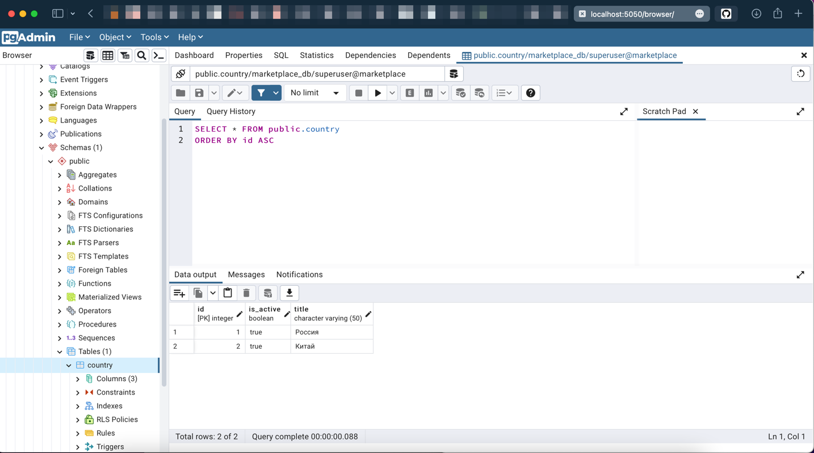

## Тема: Установка PostgreSQL

### Задача

Установка СУБД PostgreSQL

Описание/Пошаговая инструкция выполнения домашнего задания:
* Развернуть контейнер с PostgreSQL или установить СУБД на виртуальную машину
* Запустить сервер
* Создать клиента с подключением к базе данных postgres через командную строку
* Подключиться к серверу используя pgAdmin или другое аналогичное приложение

___
### Решение

Был написан сценарий для запуска контейнера с postgresql и контейнера с pgadmin.
В случае если бд пустая, заполним ее тестовыми данными

[docker-compose.yml](https://github.com/RoIVIan-V/otus_course_db_2022_05/blob/main/03/docker-compose.yml)

<pre>
  <code>
    # Запустим контейнеры
    % docker-compose -f ./docker-compose.yml -p marketplace up

    # Проверим состояние контейнеров
    % docker ps  
        CONTAINER ID   IMAGE                 COMMAND                  CREATED         STATUS                   PORTS                           NAMES
        c1d15e9a7ae3   postgres:14.4         "docker-entrypoint.s…"   5 minutes ago   Up 5 minutes (healthy)   0.0.0.0:5433->5432/tcp          postgres_container
        2f92499d5019   dpage/pgadmin4:6.10   "/entrypoint.sh"         5 minutes ago   Up 5 minutes             443/tcp, 0.0.0.0:5050->80/tcp   pgadmin_container

    # Зайдем в интерактивном режиме в контейнер postgres_container
    % docker exec -it c1d15e9a7ae3 /bin/sh  
        # psql -U superuser -d marketplace_db
        psql (14.4 (Debian 14.4-1.pgdg110+1))
        Type "help" for help.

        marketplace_db=# \l
                                             List of databases
              Name      |   Owner   | Encoding |  Collate   |   Ctype    |    Access privileges    
        ----------------+-----------+----------+------------+------------+-------------------------
         marketplace_db | superuser | UTF8     | en_US.utf8 | en_US.utf8 | 
         postgres       | superuser | UTF8     | en_US.utf8 | en_US.utf8 | 
         template0      | superuser | UTF8     | en_US.utf8 | en_US.utf8 | =c/superuser           +
                        |           |          |            |            | superuser=CTc/superuser
         template1      | superuser | UTF8     | en_US.utf8 | en_US.utf8 | =c/superuser           +
                        |           |          |            |            | superuser=CTc/superuser
        (4 rows)

        marketplace_db=# select * from country;
             id | is_active | title  
            ----+-----------+--------
              2 | t         | Китай
              1 | t         | Россия
            (2 rows)
  </code>
</pre>

Подключимся к базе через IDE

___
### Что можно улучшить

* Добавить поле в таблицу Payment с суммой платежа
* Добавить таблицу для учета комиссии на товар (группу товара)
* Добавить таблицу с доставкой (тип доставки, статус, трекер)